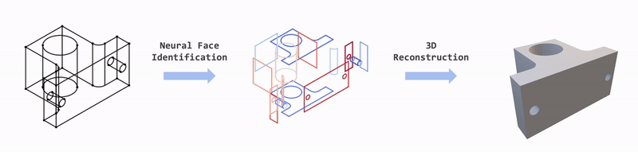

<div align="center">

# Neural Face Identification in a 2D Wireframe Projection of a Manifold Object

<h4>
  <a href='https://jason-khan.github.io/' target='_blank'>Kehan Wang</a>
  ·
  <a href='https://bertjiazheng.github.io/' target='_blank'>Jia Zheng</a>
  ·
  <a href='https://zihan-z.github.io/' target='_blank'>Zihan Zhou</a>
</h4>

<h4>
  IEEE/CVF Conference on Computer Vision and Pattern Recognition (CVPR) 2022
</h4>

[](https://arxiv.org/abs/2203.04229)
[](https://openaccess.thecvf.com/content/CVPR2022/html/Wang_Neural_Face_Identification_in_a_2D_Wireframe_Projection_of_a_CVPR_2022_paper.html)



</div>

## Requirements

```bash
conda env create --file environment.yml
conda activate faceformer
```

## Download Dataset

We use CAD mechanical models from [ABC dataset](https://archive.nyu.edu/handle/2451/43778). In order to reproduce our results, we also release the dataset used in the paper [here](https://drive.google.com/drive/u/2/folders/1ynMD02E5FWlCPmQkWyjHdq4Zhe8DIXE2). If you would like to build the dataset by yourself, please refer to [here](dataset/README.md).

## Evaluation

### Face Identification Model
Trained models can be downloaded [here](https://drive.google.com/drive/u/2/folders/1oEoN_GzS36obLjvOlwFrOpWo0N7oh-fS).
```bash
python main.py --config-file configs/{MODEL_NAME}.yml --test_ckpt trained_models/{MODEL_NAME}.ckpt
```

Face predictions will be saved to `lightning_logs/version_{LATEST}/json`.

### 3D Reconstruction

```bash
# wireframe reconstruction
python reconstruction/reconstruct_to_wireframe.py --root lightning_logs/version_{LATEST}
# surface reconstruction
python reconstruction/reconstruct_to_mesh.py --root lightning_logs/version_{LATEST}
```

Reconstructed wireframes (*.ply*) or meshes (*obj*) files will be saved to `lightning_logs/version_{LATEST}/{ply/obj}`

## Train a Model from Scratch

```bash
python main.py --config_file configs/{MODEL_NAME}.yml
```

## FAQs

- *Why does root_dir not update when I change it in configs/ours.yml?*  
Seems like when pytorch_lightning loads the checkpoint in, it also uses the old root dir which we trained the model with.
To fix: Please uncomment line 25 of faceformer/trainer.py and set the desired root_dir there.

- *How should I use the downloaded json dataset?*  
Assuming we have downloaded *data_ours.tar.gz* and unzipped it to the same directory as [split_json.py](https://drive.google.com/drive/folders/1ynMD02E5FWlCPmQkWyjHdq4Zhe8DIXE2) in the outer-most directory, we now have:

  ```
  root
  ├── main.py
  ├── split_json.py
  ├── ours
  │   └── 00000050.json
  │   └── 00000052.json
  │   └── ...
  ```
  
  Run `python split_json.py` and it should prepare the dataset into the following:
  
  ```
  root
  ├── main.py
  ├── split_json.py
  ├── ours
  │   └── test.txt
  │   └── train.txt
  │   └── valid.txt
  │   └── json
  │       └── 00000050.json
  │       └── 00000052.json
  │       └── ...
  ```
  
  With this, set the root_dir to "ours" at line 25 of faceformer/trainer.py, and 
  ```
  python main.py --config-file configs/ours.yml --test_ckpt trained_models/ours.ckpt
  ```
  should work.


## Acknowledgement

The work was done during Kehan Wang's internship at Manycore Tech Inc.
